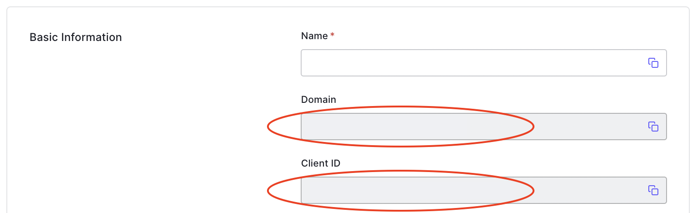
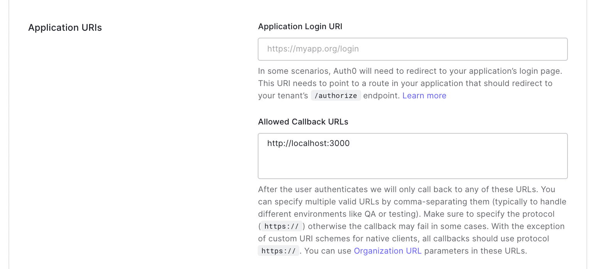

# Example using Auth0
Use Python Falcon authenticator to validate an OpenID JWT token generated by Auth0

#### 1. Configure an Auth0 application
Browse on [auth0.com](https://auth0.com/), create an Application, and fill the
client ID + oAuth domain in service.py. 



#### 2. Generate a token
Use any client side App to request and get a JWT OpenID token from Auth0,
or open a web browser and navigate to (new line inserted only for readability)
```
https://{OAUTH_DOMAIN}/authorize?
 response_type=id_token
 &scope=email
 &client_id={CLIENT_ID}
 &nonce={ANY_RANDOM_NUMBER}
 &redirect_uri=http://localhost:3000
```
After logging in, the web browser redirects to `http://localhost:3000`, and the OpenID JWT token 
is to be found within the query string.

> NB: `http://localhost:3000` must be listed as an allowed callback
> 
> 

#### 3. Test a secured API call
Run the demo
```sh
pip install -r requirements
pip install gunicorn
gunicorn --reload service:api 
```
and execute the API call
```
GET /users
Host: localhost:8000
Authorization: Bearer {AUTH0_JWT_OPENID}
```
